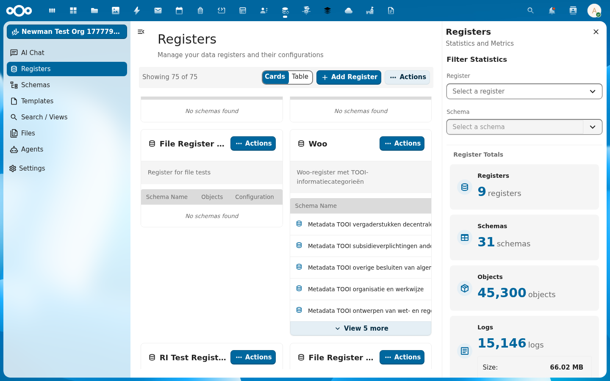

Een Woo-publicatie zonder bestanden is metadata zonder bewijs. In deze tutorial koppel je documenten aan een Woo-publicatie via vier upload-modes: één bestand, meerdere bestanden tegelijk, en grote bestanden in chunks. Plus publiceren, depubliceren en opruimen.

{/* truncate */}

## Wat je nodig hebt

- Een werkend Woo-register. Volg eerst [Een Woo-register opzetten](/academy/woo-register-opzetten) als je dat nog niet hebt
- Een publicatie-object met bekende UUID
- `curl`, basisauth, en een paar testbestanden

In de voorbeelden gebruiken we:

- Host: `http://localhost:8080`
- Auth: `admin:admin`
- Register-slug: `woo`
- Schema-slug: `onderzoeksrapporten`
- Object-UUID: `3422e6cd-1ba5-478c-b842-8f206f9d7358`

Vervang het object-UUID door de jouwe.



## Het basispatroon

Alle bestanden worden gekoppeld aan een specifiek object. De URL volgt altijd hetzelfde patroon:

```
POST /index.php/apps/openregister/api/objects/{register}/{schema}/{id}/files
```

OpenRegister maakt automatisch een map aan voor het object onder `Open Registers/{Register Title}/{Object UUID}/`. Daar landen alle bestanden. De map ontstaat zodra je het eerste bestand uploadt.

## Mode 1: één bestand via JSON en base64

De eenvoudigste route, prima voor kleine documenten tot enkele megabytes:

```bash
OBJ=3422e6cd-1ba5-478c-b842-8f206f9d7358
B64=$(echo "Inhoud van het rapport." | base64 -w0)

curl -u admin:admin \
  -X POST "http://localhost:8080/index.php/apps/openregister/api/objects/woo/onderzoeksrapporten/$OBJ/files" \
  -H "OCS-APIRequest: true" \
  -H "Content-Type: application/json" \
  -d "{
    \"name\": \"rapport-2026.txt\",
    \"content\": \"$B64\",
    \"share\": true
  }"
```

De respons:

```json
{
  "id": 3306,
  "path": "/admin/files/Open Registers/Woo Register/3422e6cd-.../rapport-2026.txt",
  "title": "rapport-2026.txt",
  "accessUrl": "http://localhost:8080/index.php/s/CH5JsTKtrczyQgw",
  "downloadUrl": "http://localhost:8080/index.php/s/CH5JsTKtrczyQgw/download",
  "type": "text/plain",
  "size": 44,
  "hash": "4bdf3a838bc59f367824ad59a14630c0",
  "published": "1970-01-01T00:00:00+00:00",
  "labels": [],
  "object": "3422e6cd-..."
}
```

`share: true` maakt direct een publieke share-link aan. De `accessUrl` is dan meteen de publieke landings-URL. Wil je het bestand vooralsnog privé houden, laat `share` weg of zet hem op `false`.

**Wanneer wel:** scripts en synchronisaties waar je tekstinhoud genereert, kleine PDF's, of CI-pipelines. **Wanneer niet:** bestanden boven enkele MB. Base64 maakt de payload 33% groter en je raakt al snel de PHP `post_max_size`-grens.

## Mode 2: één bestand binair via multipart

Voor binaire bestanden (PDF, DOCX, afbeeldingen) gebruik je het `filesMultipart`-endpoint. Dat scheelt de base64-overhead en is sneller voor middelgrote bestanden.

```bash
OBJ=3422e6cd-1ba5-478c-b842-8f206f9d7358

curl -u admin:admin \
  -X POST "http://localhost:8080/index.php/apps/openregister/api/objects/woo/onderzoeksrapporten/$OBJ/filesMultipart" \
  -H "OCS-APIRequest: true" \
  -F "files[]=@/pad/naar/rapport.pdf" \
  -F "share=true"
```

De respons is een array met één element:

```json
[
  {
    "id": 3307,
    "path": "/admin/files/Open Registers/Woo Register/3422e6cd-.../rapport.pdf",
    "title": "rapport.pdf",
    "type": "application/pdf",
    "size": 482310,
    "hash": "a4abb3649eff2d9ba4f80675371a56b8",
    "object": "3422e6cd-..."
  }
]
```

> **Let op: gebruik `files[]`, niet `file`.** Gebruik altijd `files[]` als veldnaam, ook voor één bestand. De alternatieve veldnaam `file` is bekend instabiel in de huidige OpenRegister-versie en geeft een 500-fout. Houd je aan `files[]` en je werkt rond het probleem.

## Mode 3: meerdere bestanden in één request

Het `filesMultipart`-endpoint accepteert meerdere bestanden in één enkele request. Eén HTTP-call, één transactie, één respons-array. Handig voor publicaties met meerdere bijlagen.

```bash
OBJ=3422e6cd-1ba5-478c-b842-8f206f9d7358

curl -u admin:admin \
  -X POST "http://localhost:8080/index.php/apps/openregister/api/objects/woo/onderzoeksrapporten/$OBJ/filesMultipart" \
  -H "OCS-APIRequest: true" \
  -F "files[]=@/pad/naar/bijlage-1.pdf" \
  -F "files[]=@/pad/naar/bijlage-2.pdf" \
  -F "files[]=@/pad/naar/bijlage-3.pdf" \
  -F "share=true"
```

Respons:

```json
[
  { "id": 3308, "title": "bijlage-1.pdf", "size": 29, "hash": "b753b747...", ... },
  { "id": 3309, "title": "bijlage-2.pdf", "size": 32, "hash": "f370ad27...", ... },
  { "id": 3310, "title": "bijlage-3.pdf", "size": 28, "hash": "80a9a215...", ... }
]
```

Elk bestand krijgt een eigen entry in de respons. De `share`-vlag geldt voor het hele batch: alle bestanden worden tegelijk publiek gemaakt of houden tegelijk privé.

**Praktische limiet:** PHP's `post_max_size` is meestal 100 MB. Het totaal van alle bestanden in één request mag daar niet overheen. Voor grotere uploads spring je naar Mode 4.

## Mode 4: grote bestanden in chunks via WebDAV

Bestanden boven de PHP-uploadlimiet (typisch 100 MB) splits je in chunks en verstuur je via Nextcloud's WebDAV chunked upload-protocol. Daarna verplaats je het samengestelde bestand naar de objectmap.

Dit is hetzelfde protocol dat de Nextcloud webclient en desktop-app gebruiken. Het werkt voor alle bestandsgroottes en past zich aan netwerkonderbrekingen aan.

### Stap 4.1: maak een transfer-map

Geef de transfer een unieke ID, bijvoorbeeld een tijdstempel:

```bash
TRANSFER_ID="woo-chunked-$(date +%s)"
DAV_BASE="http://localhost:8080/remote.php/dav"

curl -u admin:admin \
  -X MKCOL "$DAV_BASE/uploads/admin/$TRANSFER_ID"
```

Een 201 betekent dat de transfer-map klaar staat.

### Stap 4.2: split het bestand en upload de chunks

We splitsen een testbestand van 6 MB in drie chunks van 2 MB:

```bash
split -b 2M /pad/naar/groot-rapport.pdf /tmp/chunk-

i=1
for chunk in /tmp/chunk-*; do
  CHUNK_NUM=$(printf "%05d" $i)
  curl -u admin:admin \
    -X PUT --data-binary "@$chunk" \
    "$DAV_BASE/uploads/admin/$TRANSFER_ID/$CHUNK_NUM"
  i=$((i+1))
done
```

De chunks krijgen vijfcijferige nummers (`00001`, `00002`, `00003`). Houd de volgorde in de bestandsnamen aan, want Nextcloud assembleert op basis daarvan.

### Stap 4.3: assembleer en plaats in de objectmap

Een MOVE-call combineert de chunks tot één bestand op de uiteindelijke locatie:

```bash
OBJ=3422e6cd-1ba5-478c-b842-8f206f9d7358
DEST="$DAV_BASE/files/admin/Open%20Registers/Woo%20Register/$OBJ/groot-rapport.pdf"
TOTAL_LENGTH=$(wc -c < /pad/naar/groot-rapport.pdf)

curl -u admin:admin \
  -X MOVE "$DAV_BASE/uploads/admin/$TRANSFER_ID/.file" \
  -H "Destination: $DEST" \
  -H "OC-Total-Length: $TOTAL_LENGTH"
```

Een 201 betekent dat het bestand op de bestemming staat. OpenRegister pikt het automatisch op: zodra je de files-lijst van het object opvraagt, staat het bestand erbij.

### Stap 4.4: verifieer in OpenRegister

```bash
curl -u admin:admin \
  "http://localhost:8080/index.php/apps/openregister/api/objects/woo/onderzoeksrapporten/$OBJ/files" \
  -H "OCS-APIRequest: true"
```

Je ziet het nieuwe bestand met zijn echte grootte:

```json
{
  "id": 3316,
  "path": "/admin/files/Open Registers/Woo Register/3422e6cd-.../groot-rapport.pdf",
  "title": "groot-rapport.pdf",
  "size": 6291456,
  "hash": "d7d7eec53f6d70d1bdceea08c10d0bb1",
  "modified": "2026-05-07T05:14:34+00:00"
}
```

**Belangrijk:** chunks moeten naar de map van de actuele gebruiker (`admin` in dit voorbeeld). Een service-account upload je dus eerst in dat account; de MOVE plaatst het daarna in de gedeelde register-map.

## Publiceren en depubliceren

Een geüpload bestand staat standaard niet publiek (`accessUrl: null`). Bij Woo-publicaties wil je expliciet kiezen welke bestanden publiek zijn en welke niet, bijvoorbeeld omdat een bijlage privacygevoelig is en eerst gelakt moet worden.

Publiek maken:

```bash
FID=3306
curl -u admin:admin \
  -X POST "http://localhost:8080/index.php/apps/openregister/api/objects/woo/onderzoeksrapporten/$OBJ/files/$FID/publish" \
  -H "OCS-APIRequest: true"
```

In de respons verschijnt een `accessUrl`:

```json
{
  "id": 3306,
  "title": "rapport-2026.txt",
  "accessUrl": "http://localhost:8080/index.php/s/CH5JsTKtrczyQgw",
  "downloadUrl": "http://localhost:8080/index.php/s/CH5JsTKtrczyQgw/download"
}
```

Weer privé maken:

```bash
curl -u admin:admin \
  -X POST "http://localhost:8080/index.php/apps/openregister/api/objects/woo/onderzoeksrapporten/$OBJ/files/$FID/depublish" \
  -H "OCS-APIRequest: true"
```

Na depublicatie zijn `accessUrl` en `downloadUrl` weer `null` en is de share-link ingetrokken.

## Lijst, downloaden, verwijderen

| Actie | Methode | URL |
| --- | --- | --- |
| Lijst van bestanden bij een object | `GET` | `/api/objects/{register}/{schema}/{id}/files` |
| Detail van één bestand | `GET` | `/api/objects/{register}/{schema}/{id}/files/{fileId}` |
| Download (alle bestanden als zip) | `GET` | `/api/objects/{register}/{schema}/{id}/files/download` |
| Download direct via id | `GET` | `/api/files/{fileId}/download` |
| Verwijder één bestand | `DELETE` | `/api/objects/{register}/{schema}/{id}/files/{fileId}` |

Voorbeeld voor een lijst:

```bash
curl -u admin:admin \
  "http://localhost:8080/index.php/apps/openregister/api/objects/woo/onderzoeksrapporten/$OBJ/files" \
  -H "OCS-APIRequest: true"
```

Verwijderen van één bestand:

```bash
curl -u admin:admin \
  -X DELETE "http://localhost:8080/index.php/apps/openregister/api/objects/woo/onderzoeksrapporten/$OBJ/files/3306" \
  -H "OCS-APIRequest: true"
```

## Welke mode kies je wanneer?

| Mode | Beste voor | Limiet | Codecomplexiteit |
| --- | --- | --- | --- |
| 1. JSON + base64 | Server-naar-server scripts, kleine PDF's | ≈ 75 MB ruwe inhoud (33% overhead op `post_max_size`) | Laag |
| 2. Multipart, één bestand | Browser-uploads, gewone PDF's en DOCX | `post_max_size`, meestal 100 MB | Laag |
| 3. Multipart, meerdere bestanden | Publicaties met meerdere bijlagen | Som van bestanden onder `post_max_size` | Laag |
| 4. WebDAV chunked + MOVE | Video, scans, datasets > 100 MB | Geen praktische bovengrens | Hoog |

Voor de meeste Woo-publicaties pak je Mode 2 of 3. Pas op het moment dat een bestand groter dan 100 MB binnenkomt, schakel je over naar Mode 4.

## Probleemoplossing

**500 op `filesMultipart` met `file=`-veld:** gebruik `files[]=` in plaats van `file=`. Het `file`-pad in de huidige versie van OpenRegister normaliseert het verzoek niet correct.

**`The uploaded file exceeds upload_max_filesize`:** verhoog `upload_max_filesize` en `post_max_size` in `php.ini`, of stap over op Mode 4.

**Bestand verschijnt niet in `/files`-lijst na MOVE:** controleer dat de `Destination`-header naar `Open Registers/{Register Title}/{Object UUID}/` wijst en dat de UUID overeenkomt met een bestaand object. OpenRegister scant alleen die map.

**`accessUrl` blijft `null` na publish:** controleer of share-links aanstaan in de Nextcloud admin (Settings → Sharing → "Allow apps to use the share API"). Zonder deze instelling kunnen publicaties geen publieke link krijgen.

## Volgende stap

Met deze vier modes kun je elk type Woo-document koppelen aan een publicatie. Wil je nu:

- De publicatie samen met andere apps tonen op een portaal? Bekijk [OpenCatalogi](https://github.com/ConductionNL/opencatalogi).
- Documenten automatisch laten lakken op privacygevoelige passages? Bekijk [DocuDesk](https://github.com/ConductionNL/docudesk).
- De publicaties periodiek synchroniseren naar [PLOOI](https://open.overheid.nl)? Daar werken we aan via [OpenConnector](https://github.com/ConductionNL/openconnector).
