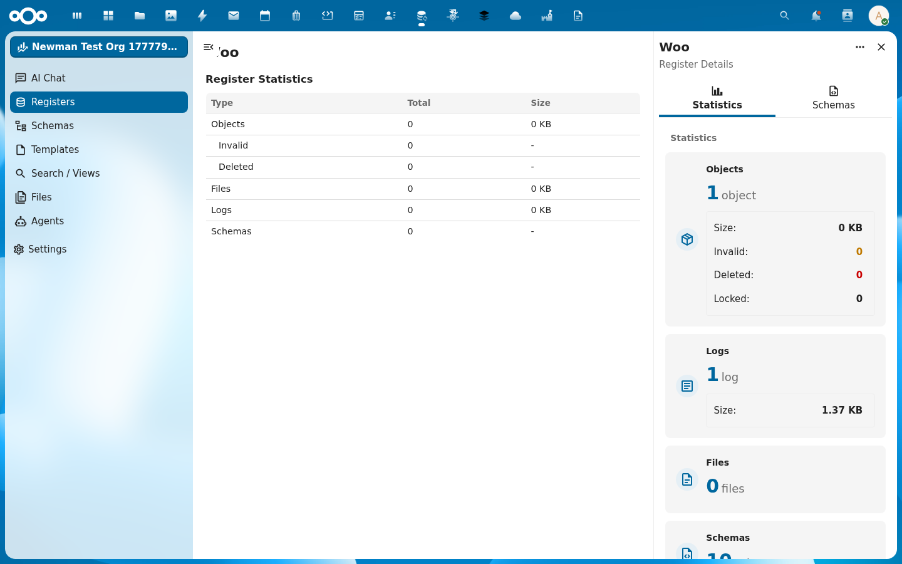
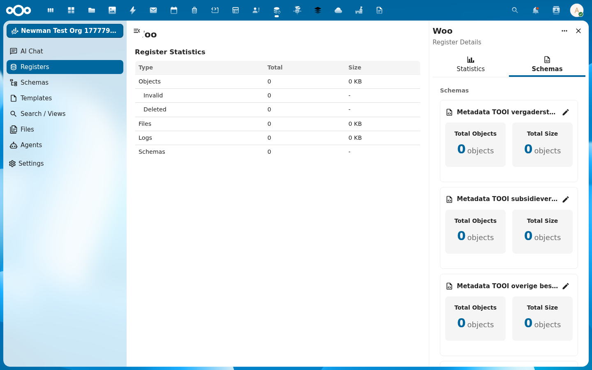

De [Wet open overheid (Woo)](https://www.rijksoverheid.nl/onderwerpen/wet-open-overheid-woo) verplicht overheden om documenten openbaar te maken in elf informatiecategorieën. OpenRegister levert het opslagmodel daarvoor. In deze tutorial importeer je het canonieke Woo-register, met alle [TOOI](https://standaarden.overheid.nl/tooi)-categorieën, in een paar minuten.

{/* truncate */}

## Wat je bouwt

Aan het einde heb je:

- Eén register met de slug `woo` in je OpenRegister-installatie
- Tien schemas, één per TOOI-informatiecategorie
- Een werkend startpunt om publicaties aan te maken en bestanden te koppelen

De [vervolgtutorial over bestanden uploaden](/academy/woo-bestanden-uploaden) bouwt hierop voort.

## Wat je nodig hebt

- Een draaiende Nextcloud met OpenRegister geïnstalleerd
- Een gebruiker met admin-rechten (of een gebruiker die registers mag aanmaken)
- `curl` of een vergelijkbare HTTP-client

In de voorbeelden gebruiken we de lokale dev-omgeving op `http://localhost:8080` met `admin:admin`. Vervang dat door je eigen host en credentials.

## De canonieke bron

Het Woo-register bestaat al, gepubliceerd door Conduction op GitHub:

```
https://raw.githubusercontent.com/ConductionNL/woo-website/main/website/static/oas/woo_register.json
```

Het is een OpenAPI-bundel van 1.0.1, met één register (`woo`) en tien schemas. Elk schema bevat de [TOOI-metadata](https://standaarden.overheid.nl/diwoo/metadata/doc/0.9.1/diwoo-metadata-lijsten_xsd_Simple_Type_diwoo_scw_woo_informatiecategorieen) van één Woo-informatiecategorie:

| Slug | Categorie |
| --- | --- |
| `vergaderstukken_decentrale_overheden` | Vergaderstukken decentrale overheden |
| `subsidieverplichtingen_anders_dan_met_beschikking` | Subsidieverplichtingen zonder beschikking |
| `overige_besluiten_van_algemene_strekking` | Overige besluiten van algemene strekking |
| `organisatie_en_werkwijze` | Organisatie en werkwijze |
| `ontwerpen_van_wet_en_regelgeving_met_adviesaanvraag` | Ontwerpen van wet- en regelgeving |
| `onderzoeksrapporten` | Onderzoeksrapporten |
| `klachtoordelen` | Klachtoordelen |
| `wetten_en_algemeen_verbindende_voorschriften` | Wetten en algemeen verbindende voorschriften |
| `woo_verzoeken_en_besluiten` | Woo-verzoeken en -besluiten |
| `convenanten` | Convenanten |
| `agendas_en_besluitenlijsten_bestuurscolleges` | Agenda's en besluitenlijsten bestuurscolleges |
| `vergaderstukken_staten_generaal` | Vergaderstukken Staten-Generaal |
| `adviezen` | Adviezen |

## Stap 1: Importeer het register

OpenRegister heeft een `import/url`-endpoint dat een OpenAPI-bundel ophaalt en in één transactie omzet naar register, schemas en (optioneel) seed-objecten.

```bash
curl -u admin:admin \
  -X POST "http://localhost:8080/index.php/apps/openregister/api/configurations/import/url" \
  -H "OCS-APIRequest: true" \
  -H "Content-Type: application/json" \
  -d '{
    "url": "https://raw.githubusercontent.com/ConductionNL/woo-website/main/website/static/oas/woo_register.json"
  }'
```

Als alles goed gaat, krijg je terug:

```json
{
  "success": true,
  "message": "Configuration imported successfully from url",
  "configurationId": 271,
  "result": {
    "registersCount": 1,
    "schemasCount": 10,
    "objectsCount": 0
  }
}
```

`registersCount: 1` en `schemasCount: 10` bevestigen dat alles is aangemaakt. De `configurationId` heb je later nodig als je de bron wilt re-syncen.

## Stap 2: Controleer wat is aangemaakt

Vraag de lijst van registers op en filter op slug `woo`:

```bash
curl -u admin:admin \
  "http://localhost:8080/index.php/apps/openregister/api/registers" \
  -H "OCS-APIRequest: true"
```

In de respons vind je een entry zoals:

```json
{
  "id": 924,
  "uuid": "cd44ca36-e3de-4d6f-9af9-abbb49710c83",
  "slug": "woo",
  "title": "Woo",
  "version": "1.0.1",
  "description": "Woo-register met TOOI-informatiecategorieën",
  "schemas": [1619, 1620, 1621, 1622, 1623, 1624, 1625, 1626, 1627, 1628]
}
```

De `id` is je interne register-id (924 in dit voorbeeld; bij jou kan het verschillen). De slug `woo` is stabiel en gebruik je verder in alle API-aanroepen.

In de UI vind je het register onder **Apps → OpenRegister → Registers**:


Klik op **View Details** in het Actions-menu van de kaart voor een statistiekenpaneel:



## Stap 3: Bekijk de schemas

De TOOI-schemas zijn metadata-schemas. Elk schema bevat zeven velden:

| Veld | Type | Beschrijving |
| --- | --- | --- |
| `tooiCategorieNaam` | string (verplicht) | Naam van de categorie |
| `tooiCategorieId` | string | TOOI-id, bijvoorbeeld `c_fdaee95e` |
| `tooiCategorieUri` | string | Volledige TOOI-URI |
| `tooiThemaNaam` | string | Optioneel thema |
| `tooiThemaId` | string | Optioneel thema-id |
| `tooiThemaUri` | string | Optioneel thema-URI |
| `values` | array | Vrij in te vullen sleutel-waarde-paren |

De `categorieId` en `categorieUri` zijn `const` in het schema. Je hoeft ze niet zelf te vullen. OpenRegister vult ze automatisch zodra je `tooiCategorieNaam` zet.



## Stap 4: Maak een eerste publicatie

Test je register met één publicatie. We pakken de categorie `onderzoeksrapporten`:

```bash
curl -u admin:admin \
  -X POST "http://localhost:8080/index.php/apps/openregister/api/objects/woo/onderzoeksrapporten" \
  -H "OCS-APIRequest: true" \
  -H "Content-Type: application/json" \
  -d '{
    "tooiCategorieNaam": "onderzoeksrapporten"
  }'
```

De respons toont onder andere:

```json
{
  "id": "3422e6cd-1ba5-478c-b842-8f206f9d7358",
  "tooiCategorieNaam": "onderzoeksrapporten",
  "tooiCategorieId": "c_fdaee95e",
  "tooiCategorieUri": "https://identifier.overheid.nl/tooi/def/thes/kern/c_fdaee95e",
  "@self": {
    "register": "924",
    "schema": "1624",
    "uri": "http://localhost:8080/apps/openregister/api/objects/924/1624/3422e6cd-...",
    "owner": "admin",
    "created": "2026-05-07T05:12:24+00:00"
  }
}
```

OpenRegister heeft de TOOI-id en URI zelf ingevuld. Het object heeft een UUID. Onthoud die UUID, want je hebt hem nodig om bestanden aan deze publicatie te koppelen.

## Stap 5 (optioneel): Voeg eigen velden toe

De canonieke schemas dekken de TOOI-metadata, niet de inhoud van de publicatie zelf. Voor titel, omschrijving, datum en verantwoordelijke organisatie maak je een eigen aanvullend schema, of breid je een bestaand schema uit.

Een minimale uitbreiding voor `onderzoeksrapporten` ziet er bijvoorbeeld zo uit:

```json
{
  "title": "Onderzoeksrapport publicatie",
  "properties": {
    "titel": { "type": "string", "maxLength": 255 },
    "omschrijving": { "type": "string", "maxLength": 2000 },
    "openbaarmakingsdatum": { "type": "string", "format": "date" },
    "verantwoordelijkeOrganisatie": { "type": "string" }
  },
  "required": ["titel", "openbaarmakingsdatum"]
}
```

Je kunt zo'n schema via `POST /api/schemas` aanmaken en daarna in de Woo-register-configuratie toevoegen. Houd het zoveel mogelijk dichtbij de [DiWoo-metadata-standaard](https://standaarden.overheid.nl/diwoo) zodat je publicaties ook door [PLOOI](https://open.overheid.nl) en [woogle.nl](https://woogle.nl) opgepikt kunnen worden.

## En nu

Je hebt:

- Een werkend Woo-register met tien TOOI-schemas
- Eén testpublicatie met UUID
- Een patroon om eigen velden toe te voegen waar nodig

In de [vervolgtutorial koppel je bestanden aan deze publicatie](/academy/woo-bestanden-uploaden), van enkele PDF's tot grote videobestanden in chunks.

## Opruimen

Als je het testregister wilt verwijderen:

```bash
curl -u admin:admin \
  -X DELETE "http://localhost:8080/index.php/apps/openregister/api/registers/924" \
  -H "OCS-APIRequest: true"
```

Dit verwijdert het register, alle schemas en alle objecten. De configuratie-import zelf blijft bestaan, zodat je hem opnieuw kunt afspelen.
